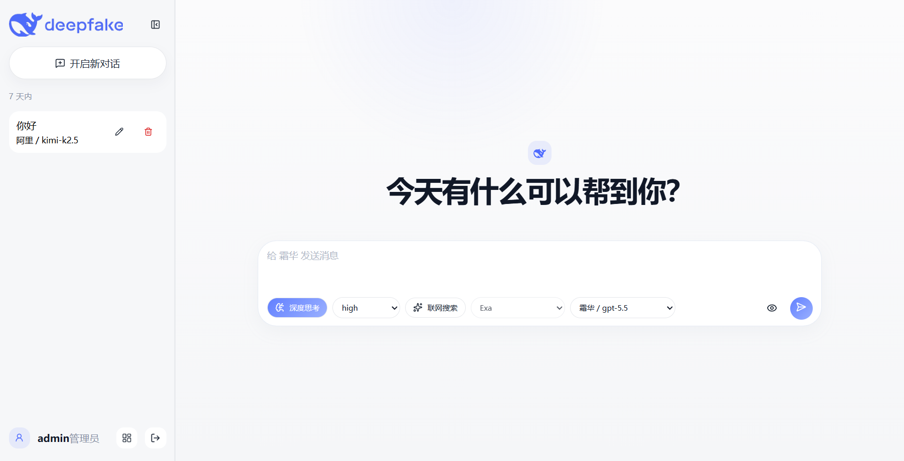
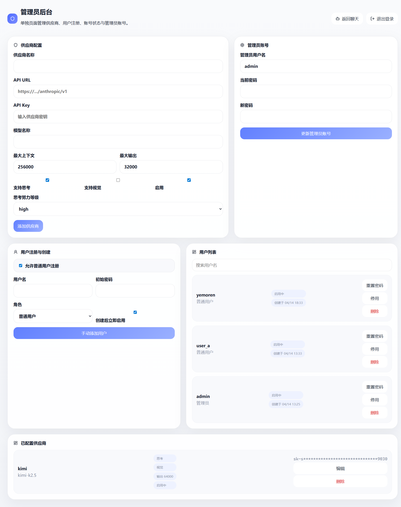

# deepfake

一个本地可运行、支持多用户与管理员后台的 AI 聊天项目。前端基于 React + TypeScript，后端基于 FastAPI，数据存储使用 SQLite，支持 Anthropic Messages API 兼容供应商、流式输出、Markdown / LaTeX 渲染和图片输入。

## 项目亮点

- 多用户注册、登录、会话隔离
- 管理员后台管理供应商、用户和注册开关
- Anthropic Messages API 兼容供应商接入
- 流式聊天输出
- Markdown / LaTeX 渲染
- 图片上传输入
- 会话重命名、删除
- 用户启用 / 停用、重置密码、手动创建与删除

## 项目截图

### 聊天主界面



### 管理员后台



## 技术栈

- Frontend: Vite + React + TypeScript
- Backend: FastAPI
- Database: SQLite

## 项目结构

```text
deepfake/
├─ frontend/   # React 前端
├─ backend/    # FastAPI 后端
├─ LICENSE
├─ README.md
└─ .gitignore
```

## 功能概览

### 用户侧

- 注册 / 登录 / 退出登录
- 独立会话列表与会话历史
- 新建、重命名、删除会话
- 文本聊天与流式回复
- Markdown / LaTeX 渲染
- 图片上传输入
- 根据模型能力动态显示思考和视觉功能

### 管理员侧

- 添加、编辑、删除供应商
- 配置模型名称、API URL、API Key、能力开关
- 修改管理员用户名和密码
- 开启或关闭普通用户注册
- 手动创建用户
- 启用 / 停用用户
- 重置用户密码
- 删除用户及其历史会话

## 运行环境

建议环境：

- Node.js 20+
- npm 10+
- Python 3.11+

当前仓库已验证环境：

- Node.js v24
- npm v11
- Python 3.14

## 安装教程

### 1. 克隆项目

```bash
git clone <your-repo-url>
cd deepfake
```

### 2. 安装前端依赖

```bash
cd frontend
npm install
```

### 3. 安装后端依赖

```bash
cd ../backend
python -m pip install -r requirements.txt
```

## 启动教程

前后端需要分别启动。

### 启动后端

在 `backend/` 目录执行：

```bash
python -m uvicorn app.main:app --host 127.0.0.1 --port 8000
```

启动后地址：

- API: `http://127.0.0.1:8000`
- Health Check: `http://127.0.0.1:8000/api/health`

### 启动前端

在 `frontend/` 目录执行：

```bash
npm run dev -- --host 127.0.0.1 --port 5173
```

启动后地址：

- Web: `http://127.0.0.1:5173`

## 默认管理员账号

后端首次启动时会自动创建默认管理员：

- 用户名：`admin`
- 密码：`admin123`

首次部署到公开环境后，建议立即修改管理员密码。

## 使用教程

### 普通用户使用流程

1. 打开前端页面 `http://127.0.0.1:5173`
2. 注册或登录账号
3. 选择供应商模型
4. 发起新对话并开始聊天
5. 可上传图片、开启思考、查看历史会话

### 管理员使用流程

1. 使用管理员账号登录
2. 在左下角点击“管理后台”
3. 先添加可用供应商
4. 根据需要开启或关闭普通用户注册
5. 管理用户状态、重置密码或删除用户

## 供应商配置说明

后端接入的是 Anthropic Messages API 兼容协议。

供应商配置项包括：

- 名称 `name`
- API URL `api_url`
- API Key `api_key`
- 模型名 `model_name`
- 是否支持思考
- 是否支持视觉
- 思考努力等级
- 最大上下文窗口
- 最大输出 token

注意：

- `api_url` 应填写 Anthropic 兼容基础地址
- 如果地址结尾还没有 `/messages`，后端会自动补上

## 数据存储说明

项目数据保存在本地 SQLite：

- 数据库文件：`backend/data/app.db`

数据库中包含：

- 用户账号
- 会话和消息
- 供应商配置
- 图片消息内容（base64）

如果你要将项目开源到 GitHub，请不要上传这个数据库文件。

## 前后端连接说明

前端 API 地址目前写死在：

- `frontend/src/api.ts`

默认值为：

```ts
const API_BASE = 'http://127.0.0.1:8000/api'
```

如果后端部署地址发生变化，需要同步修改这里。

## 常用检查命令

### 前端 lint

```bash
cd frontend
npm run lint
```

### 前端 build

```bash
cd frontend
npm run build
```

### 后端检查

```bash
cd backend
python -m compileall app
```

## 常见问题

### 1. 为什么前端连不上后端？

请确认：

- 后端正在 `127.0.0.1:8000` 运行
- 前端正在 `127.0.0.1:5173` 运行
- 前端 `src/api.ts` 中的 API 地址未被改错

### 2. 为什么管理员看不到普通用户注册？

可能是管理员已经在后台关闭了“允许普通用户注册”。

## License

本项目使用 `Apache-2.0` 开源许可证，详见根目录 `LICENSE` 文件。
